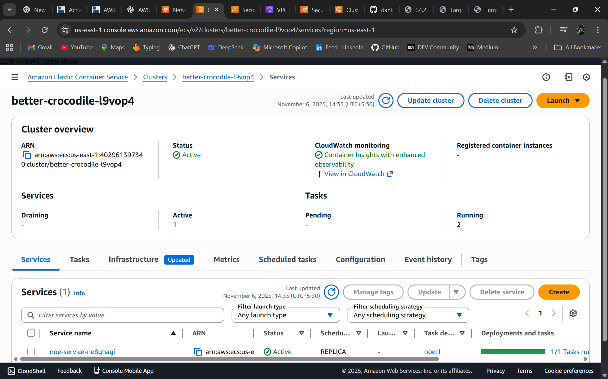
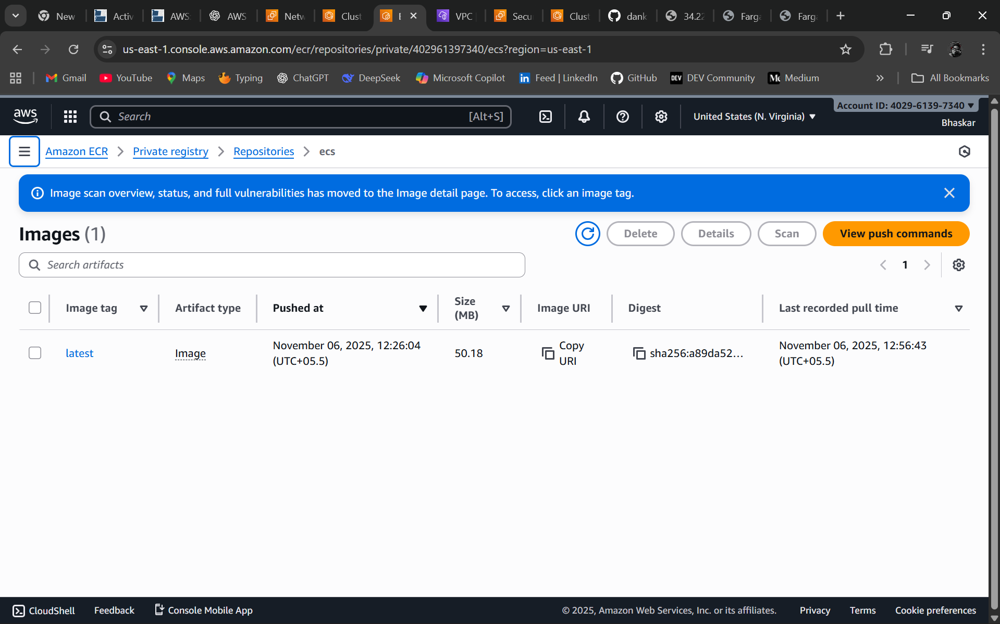
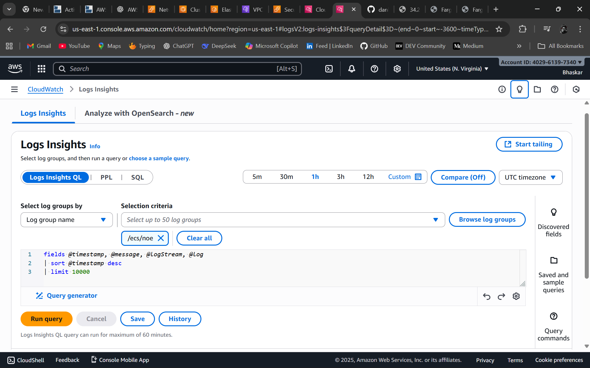
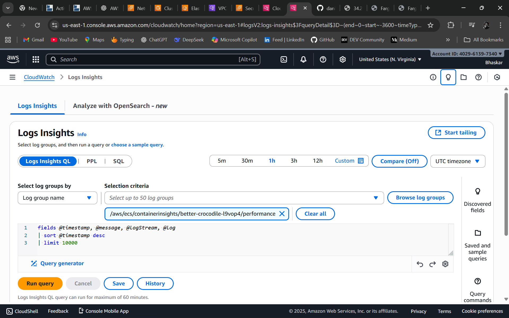
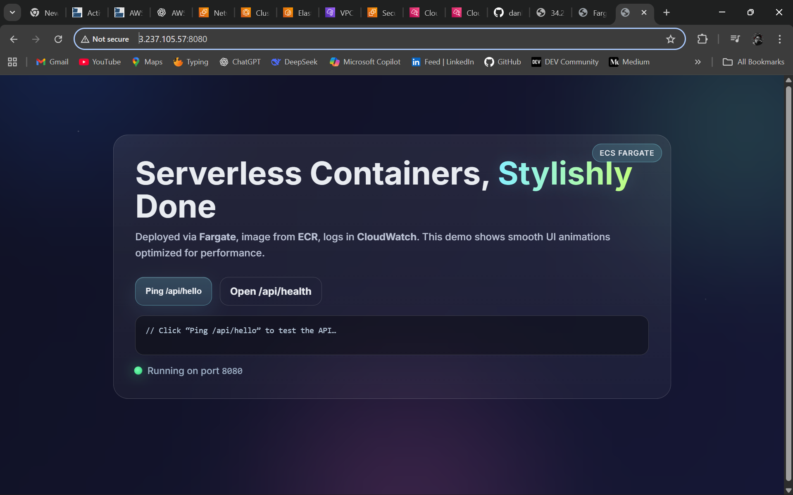
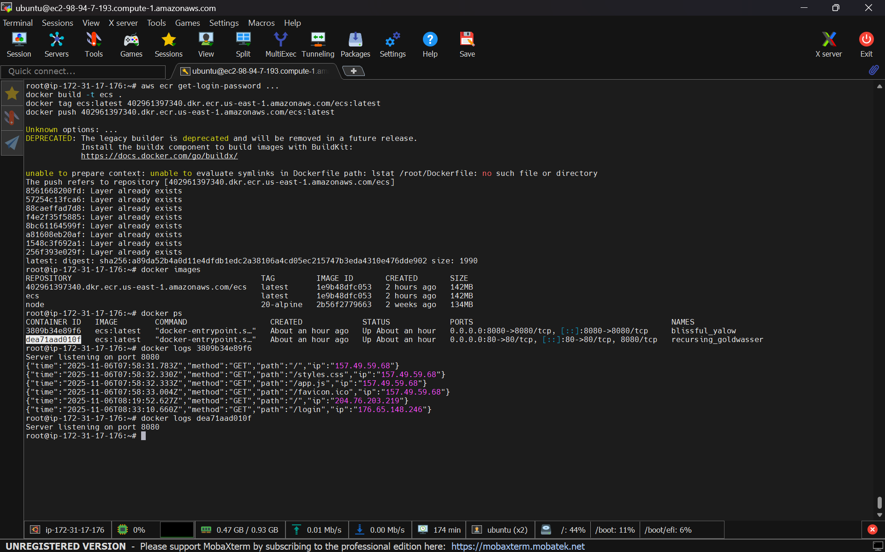

# ⚙️ AWS ECS + ECR Deployment (Project 2)

## 🧠 Overview

This project demonstrates how I containerized a **Node.js application** using **Docker**, pushed the image to **Amazon ECR**, and deployed it on **Amazon ECS** using **Fargate**.  

It showcases container orchestration, cloud-native deployment, and end-to-end CI/CD fundamentals using AWS managed services.

---

## 🏗️ Architecture

- **Docker** → Containerized Node.js app  
- **Amazon ECR** → Secure Docker image registry  
- **Amazon ECS (Fargate)** → Serverless container hosting  
- **CloudWatch** → Application monitoring and logs  

**Flow:** Developer → Docker Build → Push to ECR → Deploy to ECS → App accessible via Public IP

---

## 🖼️ Screenshots

| Step | Description | Screenshot |
|------|--------------|-------------|
| 1️⃣ | **ECR Repository** (Image pushed successfully) |  |
| 2️⃣ | **ECS Cluster** (Cluster created successfully) |  |
| 3️⃣ | **ECS Task** (Running container instance) |  |
| 4️⃣ | **CloudWatch Logs** (App logs visible) |  |
| 5️⃣ | **Browser Output** (App running on port 8080) |  |
| 6️⃣ | **Cleanup Confirmation** (Cluster deleted) |  |

---

## ⚙️ Steps I Followed

1️⃣ **Created a private ECR repository**  
   - Built a Node.js Docker image  
   - Tagged and pushed it to ECR using AWS CLI  

2️⃣ **Created an ECS Cluster**  
   - Launch type: Fargate  
   - Configured networking (VPC, subnets, and security groups)

3️⃣ **Defined an ECS Task Definition**  
   - Container image from ECR  
   - Port mapping `8080:8080`  
   - Log driver: CloudWatch  

4️⃣ **Created a Service**  
   - Desired count: 1  
   - Verified running task from ECS console  

5️⃣ **Verified Deployment**  
   - Accessed the app using public IP:  
     ```
     http://<public-ip>:8080
     ```
   - Verified logs in CloudWatch showing:  
     ```
     Server listening on port 8080
     ```

6️⃣ **Cleanup**  
   - Stopped tasks  
   - Deleted ECS service and cluster  
   - Removed ECR repository  

---

## 🧩 Tech Stack

| Service | Purpose |
|----------|----------|
| **Docker** | Containerized Node.js app |
| **Amazon ECR** | Image storage and versioning |
| **Amazon ECS (Fargate)** | Serverless container hosting |
| **CloudWatch** | Log monitoring |
| **AWS CLI** | Deployment and cleanup automation |

---

## 🏁 Project Outcome

✅ Successfully deployed a **Node.js container** using AWS ECS & ECR  
✅ Learned **container orchestration and Fargate compute model**  
✅ Monitored real-time logs via **CloudWatch**  
✅ Cleaned up all AWS resources using CLI automation  

---

## 🧑‍💻 Author

**Bhaskar Sharma**  
DevOps & Cloud Engineer  

🔗 [GitHub Profile](https://github.com/dankbhardwaj)  
🔗 [LinkedIn Profile](https://www.linkedin.com/in/bhaskar-sharma-718122202/)  

---

⭐ *Project 2 — AWS ECS + ECR Deployment | Part of Bhaskar Sharma’s Cloud Portfolio*
